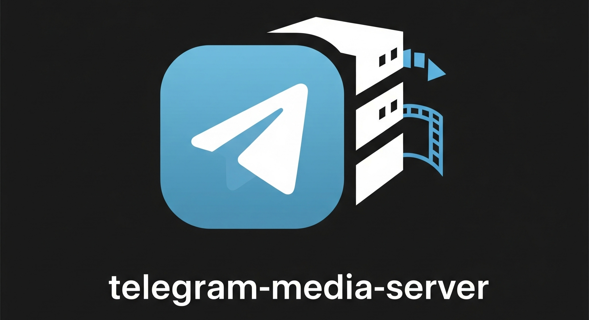
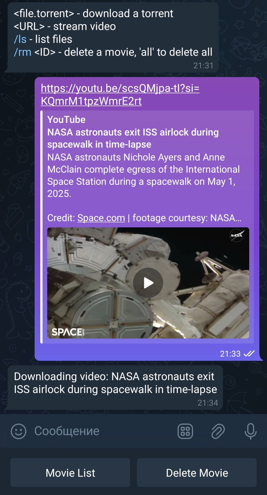
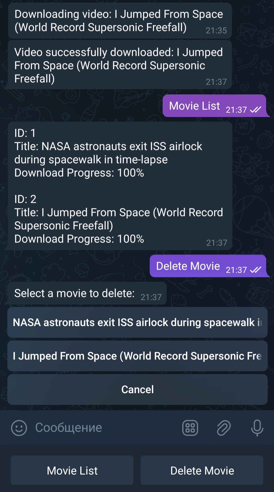

[](https://github.com/NikitaDmitryuk/telegram-media-server/actions)
[](https://codecov.io/gh/NikitaDmitryuk/telegram-media-server)
[](https://goreportcard.com/report/github.com/NikitaDmitryuk/telegram-media-server)
[](LICENSE)

**Telegram Media Server** — это Telegram-бот, который принимает ссылки на стриминговое видео или торрент-файлы, загружает их и раздает во внутренней сети через DLNA-сервер (например, `minidlna`).  
**Telegram Media Server** is a Telegram bot that accepts links to streaming videos or torrent files, downloads them, and distributes them on the internal network via a DLNA server (e.g., `minidlna`).

---

## Особенности / Features

- **Прием ссылок / Receiving links**: Поддерживает все видео-ссылки, совместимые с утилитой `yt-dlp`. Supports all video links compatible with the `yt-dlp` utility.  
- **Загрузка контента / Content Download**: Загружает видео и торрент-файлы с отслеживанием прогресса. Downloads videos and torrent files while tracking progress.  
- **Раздача во внутренней сети / Distribution in internal network**: Раздает контент через DLNA-сервер. Distributes content via a DLNA server.  
- **Управление загрузками / Download Management**: Позволяет просматривать и управлять загрузками через команды бота. Allows viewing and managing downloads via bot commands.  
- **Авторизация пользователей / User Authorization**: Доступ защищен паролями. Access is password-protected.  

---

## Зависимости / Dependencies

Для установки с помощью `sudo make install` необходимы следующие зависимости:  
To build and install Telegram Media Server using `sudo make install`, the following dependencies are required:

- **Go**: Необходим для сборки бота. Required for building the bot.  
- **yt-dlp**: Необходим для загрузки потокового видео. Required for downloading streaming videos.  
- **aria2**: Необходим для загрузки торрент-файлов. Required for downloading torrent files.  
- **minidlna** (опционально / optional): Необходим для раздачи через DLNA. Required for DLNA distribution.
- **prowlarr** (опционально / optional): Необходим для поиска торрентов. Required for searching torrents.

**Примечание**: Если вы не планируете использовать DLNA, `minidlna` не требуется.  
**Note**: If you don't plan to use DLNA, `minidlna` is not required.  

Установите зависимости с помощью пакетного менеджера вашей системы перед началом.  
Install these dependencies using your system's package manager before proceeding.

---

## Установка / Installation

Предпочтительный способ установки, который добавляет бота как системный сервис.  
The preferred method, installing the bot as a system service.

1. **Клонируйте репозиторий / Clone the repository**:

   ```bash
   git clone https://github.com/NikitaDmitryuk/telegram-media-server.git
   cd telegram-media-server
   ```

2. **Соберите и установите бота / Build and install the bot**:

   ```bash
   sudo make install
   ```

3. **Настройте бота / Configure the bot**:  
   См. раздел **Конфигурация / Configuration**.  
   See the **Configuration** section.

---

### Установка и настройка minidlna / Installing and configuring minidlna

Если вы хотите использовать DLNA, выполните следующие шаги:  
If you plan to use DLNA, follow these steps:

1. **Установите minidlna / Install minidlna**:

   ```bash
   sudo apt install minidlna
   ```

2. **Настройте minidlna / Configure minidlna**:  
   Отредактируйте файл **/etc/minidlna.conf**:  
   Edit the configuration file **/etc/minidlna.conf**:

   ```conf
   media_dir=V,/path/to/dir
   friendly_name=My DLNA Server
   ```

   Укажите в **/path/to/dir** тот же путь, что и в параметре `MOVIE_PATH` файла `.env`.  
   Replace **/path/to/dir** with the path specified in the `MOVIE_PATH` parameter of the `.env` file.

3. **Запустите minidlna / Start minidlna**:

   ```bash
   sudo systemctl enable minidlna
   sudo systemctl start minidlna
   ```

---

### Обновление yt-dlp / Keeping yt-dlp up to date

yt-dlp часто обновляется; актуальная версия важна для работы с меняющимися сайтами.  
yt-dlp is updated frequently; having the latest version is critical for compatibility with changing video sites.

Приложение само обновляет yt-dlp гибридным способом (и при старте, и по расписанию):  
The application updates yt-dlp itself in a hybrid way (on start and on a schedule):

- **При старте** — один раз выполняется `yt-dlp -U` (в фоне, не блокирует запуск).  
  **On start** — `yt-dlp -U` is run once in the background (does not block startup).
- **По расписанию** — каждые `YTDLP_UPDATE_INTERVAL` (по умолчанию 3h) снова выполняется `yt-dlp -U`.  
  **Periodic** — every `YTDLP_UPDATE_INTERVAL` (default 3h), `yt-dlp -U` is run again.

Одинаково работает при запуске через systemd и в Docker.  
Works the same when run via systemd or in Docker.

Переменные в `.env` (см. [`.env.example`](.env.example)):  
Variables in `.env` (see [`.env.example`](.env.example)):

- `YTDLP_UPDATE_ON_START` — обновлять при старте (по умолчанию `true`).  
  Update on start (default `true`).
- `YTDLP_UPDATE_INTERVAL` — интервал периодического обновления (например `3h`, `12h`). `0` — отключить периодическое обновление.  
  Interval for periodic updates (e.g. `3h`, `12h`). `0` disables periodic updates.

Для работы `yt-dlp -U` нужна установка, поддерживающая самообновление (standalone-бинарник с [релизов](https://github.com/yt-dlp/yt-dlp/releases) или `pip install yt-dlp`; пакеты из репозитория ОС часто не поддерживают `-U`).  
For `yt-dlp -U` to work, use an installation that supports self-update (standalone binary from [releases](https://github.com/yt-dlp/yt-dlp/releases) or `pip install yt-dlp`; OS package manager versions often do not support `-U`).

---

## Конфигурация / Configuration

Файл конфигурации — `.env`:  
The configuration file is `.env`:

- При использовании `sudo make install`: находится в **/etc/telegram-media-server/.env**.
- When using `sudo make install`: located at **/etc/telegram-media-server/.env**.  
- При использовании Docker Compose: находится в корне проекта.  
- When using Docker Compose: located in the project root.

**Настройка параметров / Parameter Configuration**:

Все доступные параметры конфигурации подробно описаны в файле [`.env.example`](.env.example).  
All available configuration parameters are thoroughly documented in the [`.env.example`](.env.example) file.

Создайте файл `.env` на основе `.env.example` и настройте необходимые параметры.  
Create a `.env` file based on `.env.example` and configure the required parameters.

---

## Использование / Usage

### Авторизация / Authorization

Для начала работы авторизуйтесь:  
To start using the bot, log in:

```plaintext
/login <password>
```

- Используйте `ADMIN_PASSWORD` для входа как администратор. Use `ADMIN_PASSWORD` to log in as an admin.  
- Используйте `REGULAR_PASSWORD` для входа как обычный пользователь. Use `REGULAR_PASSWORD` to log in as a regular user.

---

### Ролевая система / Role System

| **Роль / Role**          | **Авторизация / Authorization**                          | **Доступ / Access**                                                                 |
|---------------------------|---------------------------------------------------------|-------------------------------------------------------------------------------------|
| **Администратор / Admin** | Через `ADMIN_PASSWORD`. Authorized with `ADMIN_PASSWORD`. | Полный доступ, включая команду `/temp`. Full access, including the `/temp` command. |
| **Обычный пользователь / Regular User** | Через `REGULAR_PASSWORD`. Authorized with `REGULAR_PASSWORD`. | Доступ ко всем функциям, кроме `/temp`. Access to all features except `/temp`.      |
| **Временный пользователь / Temporary User** | Через временный пароль от `/temp`. Authorized with a temporary password from `/temp`. | Только добавление ссылок для загрузки. Can only add links for download.            |

---

### Доступные команды / Available commands

| **Команда / Command**       | **Описание / Description**                                                                 |
|-----------------------------|-------------------------------------------------------------------------------------------|
| `/start`                    | Приветственное сообщение. Welcome message.                                                |
| `/login <password>`         | Авторизация. User authorization.                                                          |
| `/ls`                       | Список текущих загрузок. List of current downloads.                                       |
| `/rm <id>`                  | Удаление загрузки по ID из `/ls`. Delete a download by ID from `/ls`.                     |
| `/rm all`                   | Удаление всех загрузок. Delete all downloads.                                             |
| `/temp <1d \| 3h \| 30m>`     | Генерация временного пароля (только для админа). Generate a temporary password (admin only). |

---

### Управление загрузками / Managing downloads

После авторизации отправляйте ссылки на видео или торренты. Бот поддерживает все ссылки, обрабатываемые `yt-dlp`.  
After authorization, send video or torrent links. The bot supports all links processed by `yt-dlp`.

Примеры управления:  
Examples of management:

- `/ls` — показывает статус загрузок. Shows download status.
- `/rm 1` — удаляет загрузку с ID 1. Deletes download with ID 1.

Скриншоты:  
Screenshots:  
<div style="display: flex; justify-content: space-between;">  
     
     
</div>

---

### Примеры поддерживаемых ссылок / Examples of supported links

Бот поддерживает все сервисы, совместимые с `yt-dlp`, включая:  
The bot supports all services compatible with `yt-dlp`, including:

- YouTube  
- VK  
- RuTube  
- И многие другие / And many others  

Полный список см. в [документации yt-dlp](https://github.com/yt-dlp/yt-dlp#supported-sites).  
See the full list in the [yt-dlp documentation](https://github.com/yt-dlp/yt-dlp#supported-sites).

---

## Интеграция с Prowlarr / Prowlarr Integration

**Prowlarr** — это менеджер торрент-индексаторов, который позволяет искать торрент-файлы по множеству источников. Telegram Media Server поддерживает интеграцию с Prowlarr для поиска и скачивания торрентов прямо из Telegram.
**Prowlarr** is a torrent indexer manager that allows searching torrent files from multiple sources. Telegram Media Server supports integration with Prowlarr for searching and downloading torrents directly from Telegram.

### Как включить интеграцию / How to enable integration

1. **Установите и настройте Prowlarr.**
   - Откройте веб-интерфейс Prowlarr: http://localhost:9696
   - Добавьте нужные торрент-трекеры через меню Indexers.
1. **Install and configure Prowlarr.**
   - Open the Prowlarr web interface: http://localhost:9696
   - Add desired torrent trackers via the Indexers menu.

2. **Получите API-ключ Prowlarr.**
   - В интерфейсе Prowlarr перейдите в Settings → General → Security и скопируйте API Key.
2. **Get the Prowlarr API key.**
   - In the Prowlarr interface, go to Settings → General → Security and copy the API Key.

3. **Добавьте переменные в .env:**
   ```env
   PROWLARR_URL=http://localhost:9696
   PROWLARR_API_KEY=ваш_ключ_от_prowlarr
   ```
   Если переменные не заданы, интеграция будет отключена.
3. **Add variables to .env:**
   ```env
   PROWLARR_URL=http://localhost:9696
   PROWLARR_API_KEY=your_prowlarr_api_key
   ```
   If variables are not set, integration will be disabled.

### Pre-commit hooks

Установка pre-commit hooks для автоматических проверок:
```bash
make pre-commit-install
```

Install pre-commit hooks for automatic checks:
```bash
make pre-commit-install
```