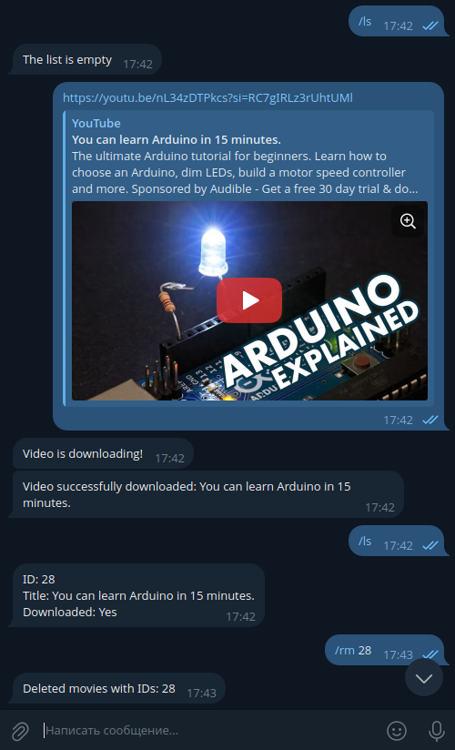
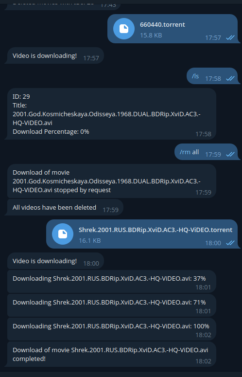

# Telegram Media Server

**Telegram Media Server** — это Telegram-бот, который принимает ссылки на стриминговое видео или торрент-файлы, загружает их и раздает во внутренней сети через DLNA-сервер (например, `minidlna`).  
**Telegram Media Server** is a Telegram bot that accepts links to streaming videos or torrent files, downloads them, and distributes them on the internal network via a DLNA server (e.g., `minidlna`).

---

## Содержание / Contents

- [Особенности / Features](#особенности--features)  
- [Зависимости / Dependencies](#зависимости--dependencies)  
- [Установка / Installation](#установка--installation)  
  - [Использование sudo make install / Using sudo make install](#использование-sudo-make-install--using-sudo-make-install)  
  - [Использование Docker Compose / Using Docker Compose](#использование-docker-compose--using-docker-compose)  
  - [Установка и настройка minidlna / Installing and configuring minidlna](#установка-и-настройка-minidlna--installing-and-configuring-minidlna)  
- [Конфигурация / Configuration](#конфигурация--configuration)  
- [Использование / Usage](#использование--usage)  
  - [Авторизация / Authorization](#авторизация--authorization)  
  - [Ролевая система / Role System](#ролевая-система--role-system)  
  - [Доступные команды / Available commands](#доступные-команды--available-commands)  
  - [Управление загрузками / Managing downloads](#управление-загрузками--managing-downloads)  
  - [Примеры поддерживаемых ссылок / Examples of supported links](#примеры-поддерживаемых-ссылок--examples-of-supported-links)  

---

## Особенности / Features

- **Прием ссылок / Receiving links**: Поддерживает все видео-ссылки, совместимые с утилитой `yt-dlp`. Supports all video links compatible with the `yt-dlp` utility.  
- **Загрузка контента / Content Download**: Загружает видео и торрент-файлы с отслеживанием прогресса. Downloads videos and torrent files while tracking progress.  
- **Раздача во внутренней сети / Distribution in internal network**: Раздает контент через DLNA-сервер. Distributes content via a DLNA server.  
- **Управление загрузками / Download Management**: Позволяет просматривать и управлять загрузками через команды бота. Allows viewing and managing downloads via bot commands.  
- **Авторизация пользователей / User Authorization**: Доступ защищен паролями. Access is password-protected.  

---

## Зависимости / Dependencies

Для установки с помощью `sudo make install` необходимы следующие зависимости:  
To build and install Telegram Media Server using `sudo make install`, the following dependencies are required:

- **Go**: Необходим для сборки бота. Required for building the bot.  
- **yt-dlp**: Необходим для загрузки потокового видео. Required for downloading streaming videos.  
- **aria2**: Необходим для загрузки торрент-файлов. Required for downloading torrent files.  
- **minidlna** (опционально / optional): Необходим для раздачи через DLNA. Required for DLNA distribution.  

**Примечание**: Если вы не планируете использовать DLNA, `minidlna` не требуется.  
**Note**: If you don’t plan to use DLNA, `minidlna` is not required.  

Установите зависимости с помощью пакетного менеджера вашей системы перед началом.  
Install these dependencies using your system’s package manager before proceeding.

---

## Установка / Installation

### Использование sudo make install / Using sudo make install

Предпочтительный способ установки, который добавляет бота как системный сервис.  
The preferred method, installing the bot as a system service.

1. **Клонируйте репозиторий / Clone the repository**:

   ```bash
   git clone https://github.com/NikitaDmitryuk/telegram-media-server.git
   cd telegram-media-server
   ```

2. **Соберите и установите бота / Build and install the bot**:

   ```bash
   sudo make install
   ```

3. **Настройте бота / Configure the bot**:  
   См. раздел [Конфигурация / Configuration](#конфигурация--configuration).  
   See the [Configuration / Configuration](#конфигурация--configuration) section.

---

### Использование Docker Compose / Using Docker Compose

Самый простой способ запуска, подходит для любой ОС и архитектуры с поддержкой Docker.  
The easiest method, works on any OS and architecture supporting Docker.

1. **Клонируйте репозиторий / Clone the repository**:

   ```bash
   git clone https://github.com/NikitaDmitryuk/telegram-media-server.git
   cd telegram-media-server
   ```

2. **Создайте и настройте файл `.env` / Create and edit the `.env` file**:

   ```bash
   cp .env.example .env
   ```

   Откройте файл `.env` в корне проекта и настройте параметры.  
   Open the `.env` file in the project root and configure the parameters.

3. **Запустите контейнер в фоновом режиме / Start the container in the background**:

   ```bash
   docker-compose up -d
   ```

4. **Проверьте логи / Check the logs**:

   ```bash
   docker-compose logs -f
   ```

5. **Остановите контейнер / Stop the container**:

   ```bash
   docker-compose down
   ```

---

### Установка и настройка minidlna / Installing and configuring minidlna

Если вы хотите использовать DLNA, выполните следующие шаги:  
If you plan to use DLNA, follow these steps:

1. **Установите minidlna / Install minidlna**:

   ```bash
   sudo apt install minidlna
   ```

2. **Настройте minidlna / Configure minidlna**:  
   Отредактируйте файл **/etc/minidlna.conf**:  
   Edit the configuration file **/etc/minidlna.conf**:

   ```conf
   media_dir=V,/path/to/dir
   friendly_name=My DLNA Server
   ```

   Укажите в **/path/to/dir** тот же путь, что и в параметре `MOVIE_PATH` файла `.env`.  
   Replace **/path/to/dir** with the path specified in the `MOVIE_PATH` parameter of the `.env` file.

3. **Запустите minidlna / Start minidlna**:

   ```bash
   sudo systemctl enable minidlna
   sudo systemctl start minidlna
   ```

---

## Конфигурация / Configuration

Файл конфигурации — `.env`:  
The configuration file is `.env`:

- При использовании `sudo make install`: находится в **/etc/telegram-media-server/.env**.
- When using `sudo make install`: located at **/etc/telegram-media-server/.env**.  
- При использовании Docker Compose: находится в корне проекта.  
- When using Docker Compose: located in the project root.

**Доступные параметры / Available parameters**:

- `BOT_TOKEN` (обязательно / required): Токен бота от BotFather. Your Telegram bot token from BotFather.
- `MOVIE_PATH`: Путь к директории для базы данных и файлов. Path to the directory for the database and files.  
- `ADMIN_PASSWORD`: Пароль для администратора. Password for admin authorization.  
- `REGULAR_PASSWORD`: Пароль для обычных пользователей. Password for regular users.  
- `LANG`: Язык сообщений (ru, en). Bot message language (ru, en).  
- `PROXY`: Адрес прокси для `yt-dlp`. Proxy address for `yt-dlp`.  
- `PROXY_HOST`: Домены, для которых использовать прокси (если пусто — всегда). Domains to use proxy for (if empty, always use proxy).

---

## Использование / Usage

### Авторизация / Authorization

Для начала работы авторизуйтесь:  
To start using the bot, log in:

```plaintext
/login <password>
```

- Используйте `ADMIN_PASSWORD` для входа как администратор. Use `ADMIN_PASSWORD` to log in as an admin.  
- Используйте `REGULAR_PASSWORD` для входа как обычный пользователь. Use `REGULAR_PASSWORD` to log in as a regular user.

---

### Ролевая система / Role System

Бот поддерживает три роли:  
The bot supports three roles:

1. **Администратор / Admin**:
   - Авторизация через `ADMIN_PASSWORD`. Authorized with `ADMIN_PASSWORD`.  
   - Полный доступ, включая команду `/temp`. Full access, including the `/temp` command.  
2. **Обычный пользователь / Regular User**:  
   - Авторизация через `REGULAR_PASSWORD`. Authorized with `REGULAR_PASSWORD`.  
   - Доступ ко всем функциям, кроме `/temp`. Access to all features except `/temp`.  
3. **Временный пользователь / Temporary User**:  
   - Авторизация через временный пароль от `/temp`. Authorized with a temporary password from `/temp`.  
   - Только добавление ссылок для загрузки. Can only add links for download.

---

### Доступные команды / Available commands

- `/start`: Приветственное сообщение. Welcome message.  
- `/login <password>`: Авторизация. User authorization.  
- `/ls`: Список текущих загрузок. List of current downloads.  
- `/rm <id>`: Удаление загрузки по ID из `/ls`. Delete a download by ID from `/ls`.  
- `/rm all`: Удаление всех загрузок. Delete all downloads.  
- `/temp <1d | 3h | 30m>`: Генерация временного пароля (только для админа). Generate a temporary password (admin only).

---

### Управление загрузками / Managing downloads

После авторизации отправляйте ссылки на видео или торренты. Бот поддерживает все ссылки, обрабатываемые `yt-dlp`.  
After authorization, send video or torrent links. The bot supports all links processed by `yt-dlp`.

Примеры управления:  
Examples of management:

- `/ls` — показывает статус загрузок. Shows download status.
- `/rm 1` — удаляет загрузку с ID 1. Deletes download with ID 1.

Скриншоты:  
Screenshots:  
<div style="display: flex; justify-content: space-between;">  
     
     
</div>

---

### Примеры поддерживаемых ссылок / Examples of supported links

Бот поддерживает все сервисы, совместимые с `yt-dlp`, включая:  
The bot supports all services compatible with `yt-dlp`, including:

- YouTube  
- VK  
- RuTube  
- И многие другие / And many others  

Полный список см. в [документации yt-dlp](https://github.com/yt-dlp/yt-dlp#supported-sites).  
See the full list in the [yt-dlp documentation](https://github.com/yt-dlp/yt-dlp#supported-sites).
