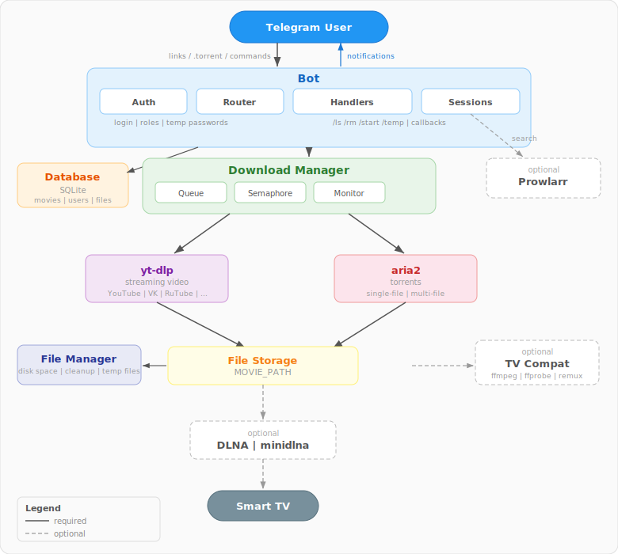

[](https://github.com/NikitaDmitryuk/telegram-media-server/actions)
[](https://codecov.io/gh/NikitaDmitryuk/telegram-media-server)
[](https://goreportcard.com/report/github.com/NikitaDmitryuk/telegram-media-server)
[](LICENSE)

**Telegram Media Server** — это Telegram-бот, который принимает ссылки на стриминговое видео или торрент-файлы, загружает их и раздает во внутренней сети через DLNA-сервер (например, `minidlna`).  
**Telegram Media Server** is a Telegram bot that accepts links to streaming videos or torrent files, downloads them, and distributes them on the internal network via a DLNA server (e.g., `minidlna`).

---

## Особенности / Features

- **Прием ссылок / Receiving links**: Поддерживает все видео-ссылки, совместимые с утилитой `yt-dlp`. Supports all video links compatible with the `yt-dlp` utility.  
- **Загрузка контента / Content Download**: Загружает видео и торрент-файлы с отслеживанием прогресса. Downloads videos and torrent files while tracking progress.  
- **Раздача во внутренней сети / Distribution in internal network**: Раздает контент через DLNA-сервер. Distributes content via a DLNA server.  
- **Управление загрузками / Download Management**: Позволяет просматривать и управлять загрузками через команды бота. Allows viewing and managing downloads via bot commands.  
- **Авторизация пользователей / User Authorization**: Доступ защищен паролями. Access is password-protected.  

---

## OpenClaw skill

An [OpenClaw](https://openclaw.ai/) skill for managing TMS downloads via the REST API (add by URL/magnet/torrent, list, delete, search) lives in **[openclaw-skill-tms/](openclaw-skill-tms/)**. Install from [ClawHub](https://clawhub.ai/): `clawhub install tms`, or copy the `openclaw-skill-tms` folder into your agent's `skills` directory. See [openclaw-skill-tms/README.md](openclaw-skill-tms/README.md) for setup (`TMS_API_URL`, `TMS_API_KEY`) and usage.

---

## REST API и Swagger / REST API and Swagger

REST API включён по умолчанию. Без `TMS_API_KEY` принимаются только запросы с localhost; с ключом — доступ по сети с авторизацией. Документация доступна по адресам ниже (базовый URL — `TMS_API_LISTEN`, по умолчанию `127.0.0.1:8080`). Ссылки работают при запущенном сервере.  
REST API is enabled by default. Without `TMS_API_KEY`, only localhost requests are accepted; with a key set, remote access with authentication is allowed. Documentation is available at the URLs below (base URL is `TMS_API_LISTEN`, default `127.0.0.1:8080`). Links work when the server is running.

- **Swagger UI** (интерактивная документация): [http://127.0.0.1:8080/api/v1/docs](http://127.0.0.1:8080/api/v1/docs) (путь path: `/api/v1/docs`)  
  **Swagger UI** (interactive docs): [http://127.0.0.1:8080/api/v1/docs](http://127.0.0.1:8080/api/v1/docs) (path: `/api/v1/docs`)
- **OpenAPI YAML**: [http://127.0.0.1:8080/api/v1/openapi.yaml](http://127.0.0.1:8080/api/v1/openapi.yaml) — спецификация для людей / human-oriented spec
- **OpenAPI LLM YAML**: [http://127.0.0.1:8080/api/v1/openapi-llm.yaml](http://127.0.0.1:8080/api/v1/openapi-llm.yaml) — для LLM/инструментов / LLM/tool-oriented spec

Маршруты документации при пустом `TMS_API_KEY` доступны только с localhost.  
Documentation routes without API key are available only from localhost.

**Swagger не открывается?** 1) В логах при старте должно быть сообщение `TMS API server starting` и адрес (например `127.0.0.1:8080`). Если видите `TMS REST API is disabled`, в `.env` указано `TMS_API_ENABLED=false` — замените на `TMS_API_ENABLED=true` или удалите эту строку. 2) Проверьте доступность API с той же машины, где запущен TMS: `curl -s http://127.0.0.1:8080/api/v1/health` — должен вернуть `{"status":"ok"}`; при `Connection refused` API не слушает (проверьте .env и логи). 3) Если страница Swagger открывается, но остаётся пустой — откройте консоль браузера (F12 → Console/Network): запрос к `openapi.yaml` не должен возвращать 401. Переменные: при **make run** (Docker) берутся из `.env` в корне проекта; при **systemd** — из `/etc/telegram-media-server/.env`.  
**Swagger not loading?** 1) On startup you should see `TMS API server starting`. If you see `TMS REST API is disabled`, set `TMS_API_ENABLED=true` in `.env` or remove that line. 2) From the host where TMS runs, run `curl -s http://127.0.0.1:8080/api/v1/health` — expect `{"status":"ok"}`; if you get connection refused, the API is not listening. 3) If the Swagger page opens but stays blank, check the browser console (F12); the request to `openapi.yaml` should not return 401.

---

## Зависимости / Dependencies

Для установки с помощью `sudo make install` необходимы следующие зависимости:  
To build and install Telegram Media Server using `sudo make install`, the following dependencies are required:

- **Go**: Необходим для сборки бота. Required for building the bot.  
- **yt-dlp**: Необходим для загрузки потокового видео. Required for downloading streaming videos.  
- **aria2**: Необходим для загрузки торрент-файлов. Required for downloading torrent files.  
- **minidlna** (опционально / optional): Необходим для раздачи через DLNA. Required for DLNA distribution.
- **prowlarr** (опционально / optional): Необходим для поиска торрентов. Required for searching torrents.

**Примечание**: Если вы не планируете использовать DLNA, `minidlna` не требуется.  
**Note**: If you don't plan to use DLNA, `minidlna` is not required.  

Установите зависимости с помощью пакетного менеджера вашей системы перед началом.  
Install these dependencies using your system's package manager before proceeding.

---

## Установка / Installation

Предпочтительный способ установки, который добавляет бота как системный сервис.  
The preferred method, installing the bot as a system service.

1. **Клонируйте репозиторий / Clone the repository**:

   ```bash
   git clone https://github.com/NikitaDmitryuk/telegram-media-server.git
   cd telegram-media-server
   ```

2. **Соберите и установите бота / Build and install the bot**:

   ```bash
   sudo make install
   ```

3. **Настройте бота / Configure the bot**:  
   См. раздел **Конфигурация / Configuration**.  
   See the **Configuration** section.

---

### Установка и настройка minidlna / Installing and configuring minidlna

Если вы хотите использовать DLNA, выполните следующие шаги:  
If you plan to use DLNA, follow these steps:

1. **Установите minidlna / Install minidlna**:

   ```bash
   sudo apt install minidlna
   ```

2. **Настройте minidlna / Configure minidlna**:  
   Отредактируйте файл **/etc/minidlna.conf**:  
   Edit the configuration file **/etc/minidlna.conf**:

   ```conf
   media_dir=V,/path/to/dir
   friendly_name=My DLNA Server
   ```

   Укажите в **/path/to/dir** тот же путь, что и в параметре `MOVIE_PATH` файла `.env`.  
   Replace **/path/to/dir** with the path specified in the `MOVIE_PATH` parameter of the `.env` file.

3. **Запустите minidlna / Start minidlna**:

   ```bash
   sudo systemctl enable minidlna
   sudo systemctl start minidlna
   ```

---

### Обновление yt-dlp / Keeping yt-dlp up to date

Приложение само обновляет yt-dlp при старте и затем по расписанию (по умолчанию раз в 3 часа). Отключить или изменить интервал можно в `.env` — см. [`.env.example`](.env.example).  
The application updates yt-dlp on start and then on a schedule (default: every 3 hours). To disable or change the interval, use `.env` — see [`.env.example`](.env.example).

Рекомендуется ставить yt-dlp с [релизов](https://github.com/yt-dlp/yt-dlp/releases) или через `pip install yt-dlp` — версии из репозитория ОС часто не поддерживают самообновление.  
Prefer installing yt-dlp from [releases](https://github.com/yt-dlp/yt-dlp/releases) or via `pip install yt-dlp`; OS package versions often do not support self-update.

---

## Конфигурация / Configuration

Файл конфигурации — `.env`:  
The configuration file is `.env`:

- При использовании `sudo make install`: находится в **/etc/telegram-media-server/.env**.
- When using `sudo make install`: located at **/etc/telegram-media-server/.env**.  
- При использовании Docker Compose: находится в корне проекта.  
- When using Docker Compose: located in the project root.

**Настройка параметров / Parameter Configuration**:

Все доступные параметры конфигурации подробно описаны в файле [`.env.example`](.env.example).  
All available configuration parameters are thoroughly documented in the [`.env.example`](.env.example) file.

Создайте файл `.env` на основе `.env.example` и настройте необходимые параметры.  
Create a `.env` file based on `.env.example` and configure the required parameters.

**Docker и сеть:** по умолчанию в `docker-compose.yml` порт API проброшен на хост (`8080:8080`), приложение слушает `0.0.0.0:8080` — Swagger и API доступны по http://localhost:8080 на Mac, Windows и Linux. На macOS/Windows режим `network_mode: host` в Docker Desktop не даёт доступа к портам контейнера с хоста, поэтому используется проброс портов. На Linux при необходимости лучшего приёма пиров для торрентов можно включить `network_mode: host` в `docker-compose.yml` (тогда порт 8080 будет доступен на хосте без явного маппинга).  
**Docker and network:** by default, the API port is published to the host (`8080:8080`) and the app listens on `0.0.0.0:8080`, so Swagger is at http://localhost:8080 on Mac, Windows, and Linux. On macOS/Windows, `network_mode: host` in Docker Desktop does not expose container ports to the host, so port mapping is used. On Linux, you can enable `network_mode: host` in `docker-compose.yml` for better torrent peer acceptance (port 8080 will then be available on the host without explicit mapping).

Совместимость с ТВ: если видео не воспроизводится — `VIDEO_COMPATIBILITY_MODE=true`. Файлы при необходимости пройдут remux. Опции: `VIDEO_TV_H264_LEVEL=4.0`/`4.1`, `VIDEO_REJECT_INCOMPATIBLE=true` — отклонять несовместимое видео.  
TV compatibility: if video won't play on your TV, set `VIDEO_COMPATIBILITY_MODE=true`. Files may be remuxed. Options: `VIDEO_TV_H264_LEVEL=4.0`/`4.1`, `VIDEO_REJECT_INCOMPATIBLE=true` — reject incompatible video.

---

## Использование / Usage

### Авторизация / Authorization

Для начала работы авторизуйтесь:  
To start using the bot, log in:

```plaintext
/login <password>
```

- Используйте `ADMIN_PASSWORD` для входа как администратор. Use `ADMIN_PASSWORD` to log in as an admin.  
- Используйте `REGULAR_PASSWORD` для входа как обычный пользователь. Use `REGULAR_PASSWORD` to log in as a regular user.

---

### Ролевая система / Role System

| **Роль / Role**          | **Авторизация / Authorization**                          | **Доступ / Access**                                                                 |
|---------------------------|---------------------------------------------------------|-------------------------------------------------------------------------------------|
| **Администратор / Admin** | Через `ADMIN_PASSWORD`. Authorized with `ADMIN_PASSWORD`. | Полный доступ, включая команду `/temp`. Full access, including the `/temp` command. |
| **Обычный пользователь / Regular User** | Через `REGULAR_PASSWORD`. Authorized with `REGULAR_PASSWORD`. | Доступ ко всем функциям, кроме `/temp`. Access to all features except `/temp`.      |
| **Временный пользователь / Temporary User** | Через временный пароль от `/temp`. Authorized with a temporary password from `/temp`. | Только добавление ссылок для загрузки. Can only add links for download.            |

---

### Доступные команды / Available commands

| **Команда / Command**       | **Описание / Description**                                                                 |
|-----------------------------|-------------------------------------------------------------------------------------------|
| `/start`                    | Приветственное сообщение. Welcome message.                                                |
| `/login <password>`         | Авторизация. User authorization.                                                          |
| `/ls`                       | Список текущих загрузок. List of current downloads.                                       |
| `/rm <id>`                  | Удаление загрузки по ID из `/ls`. Delete a download by ID from `/ls`.                     |
| `/rm all`                   | Удаление всех загрузок. Delete all downloads.                                             |
| `/temp <1d \| 3h \| 30m>`     | Генерация временного пароля (только для админа). Generate a temporary password (admin only). |

---

### Управление загрузками / Managing downloads

После авторизации отправляйте ссылки на видео или торренты. Бот поддерживает все ссылки, обрабатываемые `yt-dlp`.  
After authorization, send video or torrent links. The bot supports all links processed by `yt-dlp`.

Примеры управления:  
Examples of management:

- `/ls` — показывает статус загрузок. Shows download status.
- `/rm 1` — удаляет загрузку с ID 1. Deletes download with ID 1.

Скриншоты:  
Screenshots:  
<div style="display: flex; justify-content: space-between;">  
     
     
</div>

---

### Примеры поддерживаемых ссылок / Examples of supported links

Бот поддерживает все сервисы, совместимые с `yt-dlp`, включая:  
The bot supports all services compatible with `yt-dlp`, including:

- YouTube  
- VK  
- RuTube  
- И многие другие / And many others  

Полный список см. в [документации yt-dlp](https://github.com/yt-dlp/yt-dlp#supported-sites).  
See the full list in the [yt-dlp documentation](https://github.com/yt-dlp/yt-dlp#supported-sites).

---

## Интеграция с Prowlarr / Prowlarr Integration

**Prowlarr** — это менеджер торрент-индексаторов, который позволяет искать торрент-файлы по множеству источников. Telegram Media Server поддерживает интеграцию с Prowlarr для поиска и скачивания торрентов прямо из Telegram.
**Prowlarr** is a torrent indexer manager that allows searching torrent files from multiple sources. Telegram Media Server supports integration with Prowlarr for searching and downloading torrents directly from Telegram.

### Как включить интеграцию / How to enable integration

1. **Установите и настройте Prowlarr.**
   - Откройте веб-интерфейс Prowlarr: http://localhost:9696
   - Добавьте нужные торрент-трекеры через меню Indexers.
1. **Install and configure Prowlarr.**
   - Open the Prowlarr web interface: http://localhost:9696
   - Add desired torrent trackers via the Indexers menu.

2. **Получите API-ключ Prowlarr.**
   - В интерфейсе Prowlarr перейдите в Settings → General → Security и скопируйте API Key.
2. **Get the Prowlarr API key.**
   - In the Prowlarr interface, go to Settings → General → Security and copy the API Key.

3. **Добавьте переменные в .env:**
   ```env
   PROWLARR_URL=http://localhost:9696
   PROWLARR_API_KEY=ваш_ключ_от_prowlarr
   ```
   Если переменные не заданы, интеграция будет отключена.
3. **Add variables to .env:**
   ```env
   PROWLARR_URL=http://localhost:9696
   PROWLARR_API_KEY=your_prowlarr_api_key
   ```
   If variables are not set, integration will be disabled.

---

## Архитектура / Architecture



---

### Pre-commit hooks

Установка pre-commit hooks для автоматических проверок:
```bash
make pre-commit-install
```

Install pre-commit hooks for automatic checks:
```bash
make pre-commit-install
```