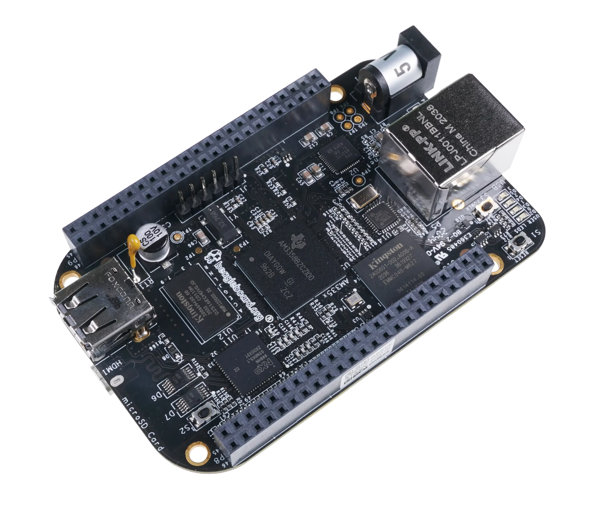
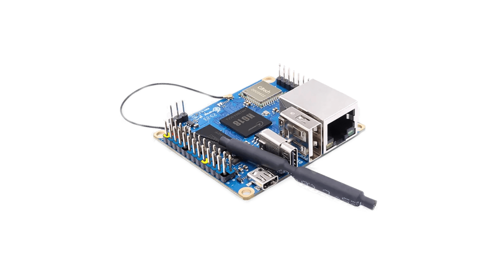

# Telegram Media Server

Telegram Media Server is a Telegram bot that accepts links to streaming videos or torrent files, downloads them and distributes them on the internal network via a DLNA server (for example, `minidlna`).

## Contents

- [Features](#features)
- [Requirements](#requirements)
- [Installation](#installation)
  - [Installing the bot](#installing-the-bot)
  - [Installing and configuring up minidlna](#installing-and-configuring-minidlna)
- [Configuration](#configuration)
- [Usage](#usage)
  - [Available commands](#available-commands)

## Features

- **Receiving links**: Supports all video links supported by the `yt-dlp` utility.
- **Content Download**: Downloads videos and torrent files, tracking download progress.
- **Distribution in internal network**: Distributes downloaded content via DLNA server.
- **Download Management**: Allows you to view and manage current downloads via bot commands.
- **User Authorization**: Access to the bot is password protected.

## Requirements

- **Operating system**: Arch Linux
- **Architectures**: `aarch64`, `armv7h`, `x86_64`
- **Dependencies**:
- **For building**: `go`
- **For running**: `yt-dlp`, `minidlna` (recommended)
- **Other**:
- Installed and configured DLNA server (e.g. `minidlna`)

The bot host can be the cheapest single-board computer, such as [Beaglebone](https://www.beagleboard.org/boards/beaglebone-black) or [Orange pi zero 3](http://www.orangepi.org/orangepiwiki/index.php/Orange_Pi_Zero_3), or any other single-board computer that can run an operating system.

<div style="display: flex; justify-content: space-between;">
  
  
</div>

## Installation

### Installing the bot

1. **Installing the package:**

Install the `telegram-media-server` package using the `pacman` package manager:

```bash
sudo pacman -U telegram-media-server.pkg.tar.zst
```

2. **Configuration:**

During installation, the sample configuration file will be copied to **/etc/telegram-media-server/.env**. If the configuration file is not created automatically, copy it manually:

```bash
sudo cp /etc/telegram-media-server/.env.example /etc/telegram-media-server/.env
```

3. **Editing the configuration:**

Open the **/etc/telegram-media-server/.env** file and configure the parameters according to your requirements.

4. **Starting the service:**

The `telegram-media-server` service should automatically be enabled and started. If this does not happen, run:

```bash
sudo systemctl enable telegram-media-server
sudo systemctl start telegram-media-server
```

### Installing and configuring minidlna

1. **Installing minidlna:**

```bash
sudo pacman -Sy minidlna
```

2. **Configuring minidlna:**

Edit the configuration file **/etc/minidlna.conf** and configure the following parameters:

```conf
media_dir=V,/path/to/dir
friendly_name=My DLNA Server
```

Replace **/path/to/dir** with the same path specified in the **MOVIE_PATH** parameter of the bot's **.env** file.

3. **Starting minidlna:**

```bash
sudo systemctl enable minidlna
sudo systemctl start minidlna
```

## Configuration

The bot configuration file is located at **/etc/telegram-media-server/.env**. Available parameters are described below:

- `BOT_TOKEN (required)`: Your Telegram bot token received from BotFather.
- `MOVIE_PATH`: Path to the directory where the database, downloaded files and movies will be stored.
- `PASSWORD`: Password for authorizing users in the bot. Login is performed once for each chat.
- `UPDATE_INTERVAL_SECONDS`: Interval in seconds for sending updates on download progress (default: `30`).
- `UPDATE_PERCENTAGE_STEP`: Download progress step in percent for sending updates (default: `20`).
- `MIN_DOWNLOAD_PERCENTAGE`: Minimum download percentage of a torrent to continue downloading (default: `10`).
- `MAX_WAIT_TIME_MINUTES`: Maximum time in minutes to wait for the minimum download percentage of a torrent (default: `10`).
- `LANG`: Bot message language. Supported values: ru, en.
- `PROXY`: Use proxy for yt-dlp. Proxy address.
- `PROXY_HOST`: Use proxy only for listed domains. If empty, use proxy always

### Example of **.env** file

```env
BOT_TOKEN=123456789:ABCDEFghIJKlmnoPQRStuvWXyz
MOVIE_PATH=/media/videos
PASSWORD=MySecretPassword
UPDATE_INTERVAL_SECONDS=30
UPDATE_PERCENTAGE_STEP=20
MIN_DOWNLOAD_PERCENTAGE=10
MAX_WAIT_TIME_MINUTES=10
LANG=en
PROXY=socks5://127.0.0.1:2080 # optional
PROXY_HOST=youtube.com,youtu.be # optional
```

## Usage

### Authorization

Before using the bot, you must log in using the command:

```plaintext
/login <password>
```

Where **<password>** is the password specified in the **PASSWORD** parameter of the .env file.

### Available commands

- `/start` — Displays a welcome message.
- `/login <password>` — User authorization in the bot.
- `/ls` — Shows a list of current downloads and their status.
- `/rm <id>` — Deletes a download by ID obtained from the /ls command.
- `/rm all` — Deletes all current downloads.
- `/stop <ID>` — Stops the download
- `/stop all` — Stops all current downloads.

### Managing downloads

After authorization, you can send the bot links to streaming videos or torrent files.
The bot supports all links that are processed by the `yt-dlp` utility.

<div style="display: flex; justify-content: space-between;">
  
  
</div>

### Examples of supported links

- YouTube
- VK
- RuTube
- and others

### Slow downloads

If the torrent file does not download to the minimum percentage (`MIN_DOWNLOAD_PERCENTAGE`) within the maximum waiting time (`MAX_WAIT_TIME_MINUTES`), the download will be automatically stopped and deleted.

# RU Documentation

Telegram Media Server — это Telegram-бот, который принимает ссылки на стриминговое видео или торрент-файлы, загружает их и раздает во внутренней сети через DLNA-сервер (например, `minidlna`).

## Оглавление

- [Особенности](#особенности)
- [Требования](#требования)
- [Установка](#установка)
  - [Установка бота](#установка-бота)
  - [Установка и настройка minidlna](#установка-и-настройка-minidlna)
- [Конфигурация](#конфигурация)
- [Использование](#использование)
  - [Доступные команды](#доступные-команды)

## Особенности

- **Прием ссылок**: Поддерживает все ссылки на видео, которые поддерживаются утилитой `yt-dlp`.
- **Загрузка контента**: Загружает видео и торрент-файлы, отслеживая прогресс загрузки.
- **Раздача во внутренней сети**: Раздает загруженный контент через DLNA-сервер.
- **Управление загрузками**: Позволяет просматривать и управлять текущими загрузками через команды бота.
- **Авторизация пользователей**: Доступ к боту защищен паролем.

## Требования

- **Операционная система**: Arch Linux
- **Архитектуры**: `aarch64`, `armv7h`, `x86_64`
- **Зависимости**:
  - **Для сборки**: `go`
  - **Для выполнения**: `yt-dlp`, `minidlna` (рекомендуется)
- **Прочее**:
  - Установленный и настроенный DLNA-сервер (например, `minidlna`)

В качестве хоста бота можно использовать самые дешевые одноплатные компьютеры, такие как [Beaglebone](https://www.beagleboard.org/boards/beaglebone-black) или [Orange pi zero 3](http://www.orangepi.org/orangepiwiki/index.php/Orange_Pi_Zero_3), а также любые другие одноплатные компьютеры на которые можно поставить операционную систему.

<div style="display: flex; justify-content: space-between;">
  
  
</div>

## Установка

### Установка бота

1. **Установка пакетa:**

Установите пакет `telegram-media-server` с помощью пакетного менеджера `pacman`:

```bash
sudo pacman -U telegram-media-server.pkg.tar.zst
```

2. **Конфигурация:**

При установке файл примера конфигурации будет скопирован в **/etc/telegram-media-server/.env**. Если файл конфигурации не создан автоматически, скопируйте его вручную:

```bash
sudo cp /etc/telegram-media-server/.env.example /etc/telegram-media-server/.env
```

3. **Редактирование конфигурации:**

Откройте файл **/etc/telegram-media-server/.env** и настройте параметры в соответствии с вашими требованиями.

4. **Запуск сервиса:**

Сервис `telegram-media-server` должен автоматически включиться и запуститься. Если этого не произошло, выполните:

```bash
sudo systemctl enable telegram-media-server
sudo systemctl start telegram-media-server
```

### Установка и настройка minidlna

1. **Установка minidlna:**

```bash
sudo pacman -Sy minidlna
```

2. **Настройка minidlna:**

Отредактируйте файл конфигурации **/etc/minidlna.conf** и настройте следующие параметры:

```conf
media_dir=V,/path/to/dir
friendly_name=My DLNA Server
```

Замените **/path/to/dir** на тот же путь, что указан в параметре **MOVIE_PATH** файла **.env** бота.

3. **Запуск minidlna:**

```bash
sudo systemctl enable minidlna
sudo systemctl start minidlna
```

## Конфигурация

Файл конфигурации бота находится по пути **/etc/telegram-media-server/.env**. Ниже описаны доступные параметры:

- `BOT_TOKEN (обязательно)`: Токен вашего Telegram-бота, полученный от BotFather.
- `MOVIE_PATH`: Путь к директории, где будут храниться база данных, загружаемые файлы и фильмы.
- `PASSWORD`: Пароль для авторизации пользователей в боте. Вход выполняется один раз для каждого чата.
- `UPDATE_INTERVAL_SECONDS`: Интервал в секундах для отправки обновлений о прогрессе загрузки (по умолчанию: `30`).
- `UPDATE_PERCENTAGE_STEP`: Шаг прогресса загрузки в процентах для отправки обновлений (по умолчанию: `20`).
- `MIN_DOWNLOAD_PERCENTAGE`: Минимальный процент загрузки торрента для продолжения загрузки (по умолчанию: `10`).
- `MAX_WAIT_TIME_MINUTES`: Максимальное время в минутах ожидания загрузки минимального процента торрента (по умолчанию: `10`).
- `LANG`: Язык сообщений бота. Поддерживаемые значения: ru, en.
- `PROXY`: Использовать прокси для yt-dlp. Адрес прокси.
- `PROXY_HOST`: Использовать прокси только для перечисленных доменов. Если пустое, то использовать прокси всегда

### Пример файла **.env**

```env
BOT_TOKEN=123456789:ABCDEFghIJKlmnoPQRStuvWXyz
MOVIE_PATH=/media/videos
PASSWORD=MySecretPassword
UPDATE_INTERVAL_SECONDS=30
UPDATE_PERCENTAGE_STEP=20
MIN_DOWNLOAD_PERCENTAGE=10
MAX_WAIT_TIME_MINUTES=10
LANG=en
PROXY=socks5://127.0.0.1:2080 # опционально
PROXY_HOST=youtube.com,youtu.be # опционально
```

## Использование

### Авторизация

Перед использованием бота необходимо авторизоваться с помощью команды:

```plaintext
/login <password>
```

Где **<password>** — пароль, указанный в параметре **PASSWORD** файла .env.

### Доступные команды

- `/start` — Отображает приветственное сообщение.
- `/login <password>` — Авторизация пользователя в боте.
- `/ls` — Показывает список текущих загрузок и их статус.
- `/rm <id>` — Удаляет загрузку по ID, полученному из команды /ls.
- `/rm all` — Удаляет все текущие загрузки.
- `/stop <ID>` — Останавливает загрузку
- `/stop all` — Останавливает все текущие загрузки.

### Управление загрузками

После авторизации вы можете отправлять боту ссылки на потоковые видео или торрент-файлы.
Бот поддерживает все ссылки, которые обрабатываются утилитой `yt-dlp`.

<div style="display: flex; justify-content: space-between;">
  
  
</div>

### Примеры поддерживаемых ссылок

- YouTube
- VK
- RuTube
- и другие

### Медленные загрузки

Если торрент-файл не загрузится на минимальный процент (`MIN_DOWNLOAD_PERCENTAGE`) в течение максимального времени ожидания (`MAX_WAIT_TIME_MINUTES`), загрузка будет автоматически остановлена и удалена.
