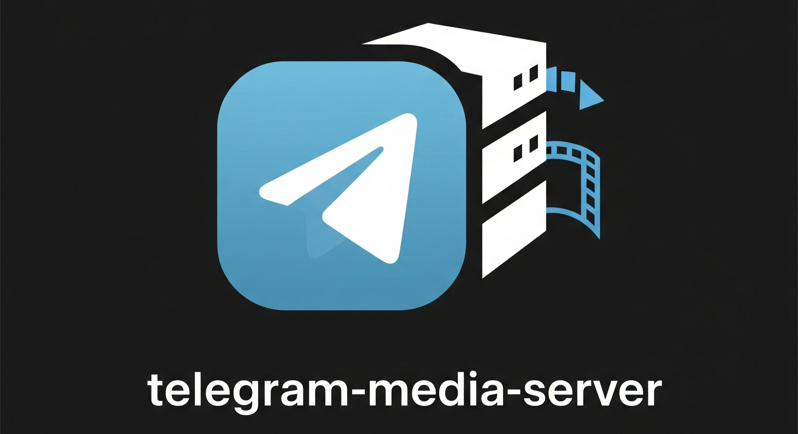
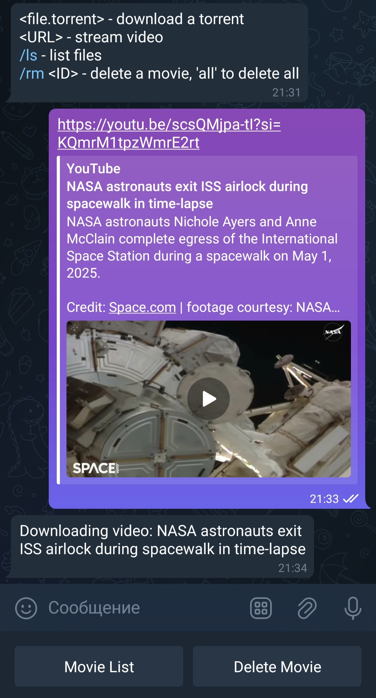
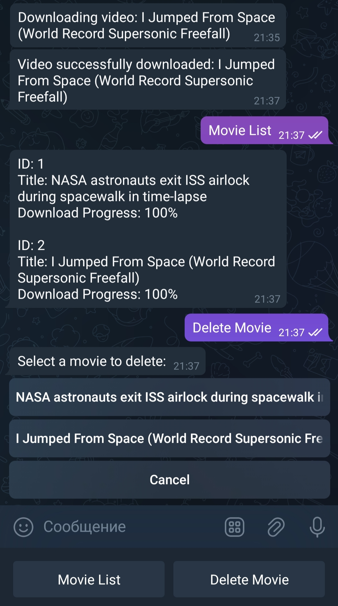
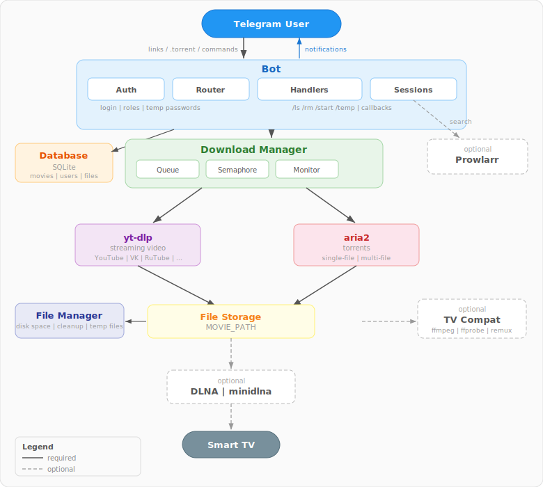

[](https://github.com/NikitaDmitryuk/telegram-media-server/actions)
[](https://codecov.io/gh/NikitaDmitryuk/telegram-media-server)
[](https://goreportcard.com/report/github.com/NikitaDmitryuk/telegram-media-server)
[](LICENSE)

**Telegram Media Server** — это Telegram-бот, который принимает ссылки на стриминговое видео или торрент-файлы, загружает их и раздает во внутренней сети через DLNA-сервер (например, `minidlna`).  
**Telegram Media Server** is a Telegram bot that accepts links to streaming videos or torrent files, downloads them, and distributes them on the internal network via a DLNA server (e.g., `minidlna`).

---

## Особенности / Features

- **Прием ссылок / Receiving links**: Поддерживает все видео-ссылки, совместимые с утилитой `yt-dlp`. Supports all video links compatible with the `yt-dlp` utility.  
- **Загрузка контента / Content Download**: Загружает видео и торрент-файлы с отслеживанием прогресса. Downloads videos and torrent files while tracking progress.  
- **Раздача во внутренней сети / Distribution in internal network**: Раздает контент через DLNA-сервер. Distributes content via a DLNA server.  
- **Управление загрузками / Download Management**: Позволяет просматривать и управлять загрузками через команды бота. Allows viewing and managing downloads via bot commands.  
- **Авторизация пользователей / User Authorization**: Доступ защищен паролями. Access is password-protected.  

---

## OpenClaw skill

An [OpenClaw](https://openclaw.ai/) skill for managing TMS downloads via the REST API (add by URL/magnet/torrent, list, delete, search) lives in **[openclaw-skill-tms/](openclaw-skill-tms/)**. Install from [ClawHub](https://clawhub.ai/): `openclaw skills install tms`, or copy the `openclaw-skill-tms` folder into your agent's `skills` directory. See [openclaw-skill-tms/README.md](openclaw-skill-tms/README.md) for setup (`TMS_API_URL`, `TMS_API_KEY`) and usage.

**Integration requirements:** the skill uses the TMS REST API. With Ansible installs the API key is generated in `/etc/telegram-media-server/.env`. If `OPENCLAW_ENABLED=true` is set in the local Ansible input `.env`, Ansible installs OpenClaw on the server, copies the local `openclaw-skill-tms` skill into OpenClaw's managed skills directory, configures model defaults, and enables hooks for TMS completion events.

- **TMS side:** Ansible uses `http://127.0.0.1:18789/hooks/tms` by default and generates/preserves `TMS_WEBHOOK_TOKEN` in the server runtime env.
- **OpenClaw side:** Ansible writes `hooks.enabled`, `hooks.token`, and a `/hooks/tms` mapping into `/var/lib/openclaw/.openclaw/openclaw.json`.

TMS will POST JSON `{ id, title, status, error?, event_id }` to the webhook on completion/failure/stopped. Full webhook details: [openclaw-skill-tms/README.md](openclaw-skill-tms/README.md#optional--webhook).

---

## REST API и Swagger / REST API and Swagger

REST API включён по умолчанию. Без `TMS_API_KEY` принимаются только запросы с localhost; с ключом — доступ по сети с авторизацией. Документация доступна по адресам ниже (базовый URL — `TMS_API_LISTEN`, по умолчанию `127.0.0.1:8080`). Ссылки работают при запущенном сервере.  
REST API is enabled by default. Without `TMS_API_KEY`, only localhost requests are accepted; with a key set, remote access with authentication is allowed. Documentation is available at the URLs below (base URL is `TMS_API_LISTEN`, default `127.0.0.1:8080`). Links work when the server is running.

- **Swagger UI** (интерактивная документация): [http://127.0.0.1:8080/api/v1/docs](http://127.0.0.1:8080/api/v1/docs) (путь path: `/api/v1/docs`)  
  **Swagger UI** (interactive docs): [http://127.0.0.1:8080/api/v1/docs](http://127.0.0.1:8080/api/v1/docs) (path: `/api/v1/docs`)
- **OpenAPI YAML**: [http://127.0.0.1:8080/api/v1/openapi.yaml](http://127.0.0.1:8080/api/v1/openapi.yaml) — спецификация для людей / human-oriented spec
- **OpenAPI LLM YAML**: [http://127.0.0.1:8080/api/v1/openapi-llm.yaml](http://127.0.0.1:8080/api/v1/openapi-llm.yaml) — для LLM/инструментов / LLM/tool-oriented spec

Маршруты документации при пустом `TMS_API_KEY` доступны только с localhost.  
Documentation routes without API key are available only from localhost.

---

## Зависимости / Dependencies

Для удаленной установки через Ansible нужны локальные инструменты и Arch Linux сервер с SSH-доступом.  
Remote installation uses Ansible from your workstation and targets an Arch Linux server over SSH.

- **Go**: локальная сборка бинаря для сервера. Local build of the server binary.
- **Ansible**: настройка сервера, systemd, qBittorrent, Prowlarr и деплой. Configures the server and deploys TMS.
- **SSH + sudo** на целевом сервере. SSH + sudo on the target host.
- **yay** или **paru** на целевом Arch Linux сервере: нужен для установки Prowlarr из AUR.

Ansible устанавливает runtime-зависимости на сервер: `ffmpeg`, `yt-dlp`, `aria2`, `qbittorrent-nox`, Prowlarr из AUR и, если включено, `minidlna`.  
Ansible installs runtime dependencies on the server: `ffmpeg`, `yt-dlp`, `aria2`, `qbittorrent-nox`, Prowlarr from AUR, and optionally `minidlna`.

На macOS локальные зависимости обычно ставятся так:

```bash
brew install go ansible
```

---

## Установка / Installation

Основной путь установки — `make install`, который локально собирает `linux/amd64` бинарь и запускает Ansible. В первой версии Ansible installer поддерживает Arch Linux сервер. По умолчанию настраиваются TMS, qBittorrent и Prowlarr; minidlna включается отдельной переменной.  
The main installation path is `make install`: it builds a `linux/amd64` binary locally and runs Ansible. The first Ansible installer version targets Arch Linux. TMS, qBittorrent, and Prowlarr are enabled by default; minidlna is opt-in.

```bash
git clone https://github.com/NikitaDmitryuk/telegram-media-server.git
cd telegram-media-server
cp ops/ansible/inventory.ini.example ops/ansible/inventory.ini
cp ops/ansible/group_vars/telegram_server.yml.example ops/ansible/group_vars/telegram_server.yml
cp .env.example .env
make install
```

Минимальный локальный `.env`:

```env
BOT_TOKEN=123456:telegram-bot-token
ADMIN_PASSWORD=change-me-admin
REGULAR_PASSWORD=change-me-regular
```

Локальный `.env` — это input для Ansible, а не runtime-файл сервера. Ansible генерирует `/etc/telegram-media-server/.env` на сервере и добавляет туда paths, qBittorrent credentials, TMS API key, Prowlarr settings и service defaults.

В локальном `.env` стоит держать пользовательские политики, например `VIDEO_COMPATIBILITY_MODE=false|true` для совместимости со старыми телевизорами.  

`TMS_API_KEY`, пароль qBittorrent, Prowlarr-поля, пути и порты задавать локально не нужно. Ansible сохранит их из существующего `/etc/telegram-media-server/.env`, а для новой установки сгенерирует `TMS_API_KEY` и `QBITTORRENT_PASSWORD`. Если нужно переопределить пользовательские секреты через encrypted Ansible Vault вместо локального `.env`, создайте `ops/ansible/group_vars/telegram_server.vault.yml`:

```yaml
bot_token: "123456:telegram-bot-token"
admin_password: "change-me-admin"
regular_password: "change-me-regular"
```

Каталог для фильмов и DLNA включаются в локальном `.env`:

```env
MOVIE_PATH=/media/telegram-media-server
MINIDLNA_ENABLED=true
```

Ansible создаст `MOVIE_PATH`, настроит TMS и qBittorrent на тот же путь, а при `MINIDLNA_ENABLED=true` установит и запустит minidlna.

Чтобы включить webhook для OpenClaw:

```env
OPENCLAW_ENABLED=true
OPENCLAW_PROVIDER_ID=custom
OPENCLAW_PROVIDER_BASE_URL=https://llm.example.com/v1
OPENCLAW_MODEL=gpt-5.4
OPENCLAW_API_KEY=...
OPENCLAW_TELEGRAM_BOT_TOKEN=123456:openclaw-bot-token
```

Ansible установит `nodejs`, `npm`, `openclaw@latest`, создаст пользователя `openclaw`, systemd service `openclaw.service`, поставит TMS skill из `openclaw-skill-tms/`, включит Telegram channel в OpenClaw, задаст `TMS_WEBHOOK_URL=http://127.0.0.1:18789/hooks/tms` и сгенерирует `TMS_WEBHOOK_TOKEN`, если его еще нет в серверном `/etc/telegram-media-server/.env`. Локально `TMS_WEBHOOK_URL` и `TMS_WEBHOOK_TOKEN` обычно хранить не нужно.

Use a separate Telegram bot token for OpenClaw. Do not reuse TMS `BOT_TOKEN`, because both services use Telegram long polling and one bot token can only have one active polling consumer.

OpenClaw model settings are local Ansible input:

```env
OPENCLAW_PROVIDER_ID=custom
OPENCLAW_PROVIDER_BASE_URL=https://llm.example.com/v1
OPENCLAW_MODEL=gpt-5.4
OPENCLAW_FALLBACK_MODELS=gpt-5.3
OPENCLAW_API_KEY=...
OPENCLAW_API_KEY_ENV=CUSTOM_API_KEY
OPENCLAW_GATEWAY_PORT=18789
OPENCLAW_TELEGRAM_ENABLED=true
OPENCLAW_TELEGRAM_DM_POLICY=pairing
OPENCLAW_TELEGRAM_ALLOW_FROM=
OPENCLAW_TELEGRAM_GROUP_POLICY=allowlist
OPENCLAW_TELEGRAM_GROUP_ALLOW_FROM=
OPENCLAW_TELEGRAM_GROUPS=
OPENCLAW_TELEGRAM_GROUPS_REQUIRE_MENTION=true
```

`OPENCLAW_PROVIDER_ID` is the OpenClaw provider namespace. `OPENCLAW_MODEL` is the model id inside that provider; Ansible writes the primary model ref as `OPENCLAW_PROVIDER_ID/OPENCLAW_MODEL`. For example, `custom` + `qwen/qwen3` becomes `custom/qwen/qwen3`.

`OPENCLAW_API_KEY` is the actual provider API key copied into `/etc/openclaw/openclaw.env`. `OPENCLAW_API_KEY_ENV` is only the environment variable name referenced from OpenClaw config; it can be omitted because Ansible derives it from the provider id, for example `custom` becomes `CUSTOM_API_KEY`.

Обновление уже настроенного сервера:

```bash
make deploy
```

Перед заменой бинаря Ansible создает backup предыдущего файла на сервере. Для проверки Ansible-синтаксиса:

```bash
make ansible-check
```

Для post-install smoke и сценарного теста полного цикла API/qBittorrent/Prowlarr/OpenClaw:

```bash
make test-remote
```

`make test-remote` добавляет fixture torrent Big Buck Bunny через TMS API, удаляет его через `DELETE /api/v1/downloads/{id}` и проверяет, что запись исчезла из списка загрузок.

---

### Обновление yt-dlp / Keeping yt-dlp up to date

Приложение само обновляет yt-dlp при старте и затем по расписанию (по умолчанию раз в 3 часа). Отключить или изменить интервал можно в `.env` — см. [`.env.example`](.env.example).  
The application updates yt-dlp on start and then on a schedule (default: every 3 hours). To disable or change the interval, use `.env` — see [`.env.example`](.env.example).

Рекомендуется ставить yt-dlp с [релизов](https://github.com/yt-dlp/yt-dlp/releases) или через `pip install yt-dlp` — версии из репозитория ОС часто не поддерживают самообновление.  
Prefer installing yt-dlp from [releases](https://github.com/yt-dlp/yt-dlp/releases) or via `pip install yt-dlp`; OS package versions often do not support self-update.

---

## Конфигурация / Configuration

Файл конфигурации — `.env`:  
The configuration file is `.env`:

- При использовании Ansible: локальный `.env` в репозитории — input; серверный **/etc/telegram-media-server/.env** генерируется Ansible и не редактируется вручную.
- When using Ansible: local repo `.env` is input; server **/etc/telegram-media-server/.env** is generated by Ansible and should not be edited manually.
- При использовании Docker Compose: находится в корне проекта.  
- When using Docker Compose: located in the project root.

**Настройка параметров / Parameter Configuration**:

Все доступные параметры конфигурации подробно описаны в файле [`.env.example`](.env.example).  
All available configuration parameters are thoroughly documented in the [`.env.example`](.env.example) file.

Создайте файл `.env` на основе `.env.example` и настройте необходимые параметры.  
Create a `.env` file based on `.env.example` and configure the required parameters.

**Docker и сеть:** по умолчанию в `docker-compose.yml` порт API проброшен на хост (`8080:8080`), приложение слушает `0.0.0.0:8080` — Swagger и API доступны по http://localhost:8080 на Mac, Windows и Linux. На macOS/Windows режим `network_mode: host` в Docker Desktop не даёт доступа к портам контейнера с хоста, поэтому используется проброс портов. На Linux при необходимости лучшего приёма пиров для торрентов можно включить `network_mode: host` в `docker-compose.yml` (тогда порт 8080 будет доступен на хосте без явного маппинга).  
**Docker and network:** by default, the API port is published to the host (`8080:8080`) and the app listens on `0.0.0.0:8080`, so Swagger is at http://localhost:8080 on Mac, Windows, and Linux. On macOS/Windows, `network_mode: host` in Docker Desktop does not expose container ports to the host, so port mapping is used. On Linux, you can enable `network_mode: host` in `docker-compose.yml` for better torrent peer acceptance (port 8080 will then be available on the host without explicit mapping).

**Docker + qBittorrent (локальная связка):** в `docker-compose.yml` добавлен сервис `qbittorrent` (Web UI на порту 8081). TMS подключается по `QBITTORRENT_URL=http://qbittorrent:8081`. Конфиг с логином **admin** и паролем **adminadmin** подмонтирован из `docker/qbittorrent.conf` — в `.env` укажите `MOVIE_PATH=/app/media` и при необходимости `QBITTORRENT_USERNAME=admin`, `QBITTORRENT_PASSWORD=adminadmin`.  
**Docker + qBittorrent (local testing):** the compose file includes a `qbittorrent` service (Web UI on port 8081). TMS connects via `QBITTORRENT_URL=http://qbittorrent:8081`. A config with login **admin** and password **adminadmin** is mounted from `docker/qbittorrent.conf`; set `MOVIE_PATH=/app/media` in `.env` and optionally `QBITTORRENT_USERNAME=admin`, `QBITTORRENT_PASSWORD=adminadmin`.

**qBittorrent:** Ansible настраивает `qbittorrent-nox` на `127.0.0.1:8081`, тот же `MOVIE_PATH`, что и TMS, и синхронизирует учетные данные с `/etc/telegram-media-server/.env`.  
**qBittorrent:** Ansible configures `qbittorrent-nox` on `127.0.0.1:8081`, uses the same `MOVIE_PATH` as TMS, and syncs credentials into `/etc/telegram-media-server/.env`.

Если `QBITTORRENT_URL` задан, ошибки подключения/логина qBittorrent считаются ошибками конфигурации и не скрываются автоматическим переходом на aria2. Для намеренного fallback задайте `TORRENT_FALLBACK_TO_ARIA2=true`. После перезагрузки TMS повторно логинится в qBittorrent Web API и восстанавливает мониторинг незавершённых загрузок по сохранённому hash.  
When `QBITTORRENT_URL` is set, qBittorrent connection/login failures are treated as configuration errors and are not hidden by automatic aria2 fallback. Set `TORRENT_FALLBACK_TO_ARIA2=true` only if you intentionally want that fallback. After reboot, TMS logs in to the qBittorrent Web API again and resumes monitoring incomplete downloads by the stored hash.

Совместимость с ТВ: если видео не воспроизводится — `VIDEO_COMPATIBILITY_MODE=true`. Файлы при необходимости пройдут remux. Опции: `VIDEO_TV_H264_LEVEL=4.0`/`4.1`, `VIDEO_REJECT_INCOMPATIBLE=true` — отклонять несовместимое видео.  
TV compatibility: if video won't play on your TV, set `VIDEO_COMPATIBILITY_MODE=true`. Files may be remuxed. Options: `VIDEO_TV_H264_LEVEL=4.0`/`4.1`, `VIDEO_REJECT_INCOMPATIBLE=true` — reject incompatible video.

---

## Использование / Usage

### Авторизация / Authorization

Для начала работы авторизуйтесь:  
To start using the bot, log in:

```plaintext
/login <password>
```

- Используйте `ADMIN_PASSWORD` для входа как администратор. Use `ADMIN_PASSWORD` to log in as an admin.  
- Используйте `REGULAR_PASSWORD` для входа как обычный пользователь. Use `REGULAR_PASSWORD` to log in as a regular user.

---

### Ролевая система / Role System

| **Роль / Role**          | **Авторизация / Authorization**                          | **Доступ / Access**                                                                 |
|---------------------------|---------------------------------------------------------|-------------------------------------------------------------------------------------|
| **Администратор / Admin** | Через `ADMIN_PASSWORD`. Authorized with `ADMIN_PASSWORD`. | Полный доступ, включая команду `/temp`. Full access, including the `/temp` command. |
| **Обычный пользователь / Regular User** | Через `REGULAR_PASSWORD`. Authorized with `REGULAR_PASSWORD`. | Доступ ко всем функциям, кроме `/temp`. Access to all features except `/temp`.      |
| **Временный пользователь / Temporary User** | Через временный пароль от `/temp`. Authorized with a temporary password from `/temp`. | Только добавление ссылок для загрузки. Can only add links for download.            |

---

### Доступные команды / Available commands

| **Команда / Command**       | **Описание / Description**                                                                 |
|-----------------------------|-------------------------------------------------------------------------------------------|
| `/start`                    | Приветственное сообщение. Welcome message.                                                |
| `/login <password>`         | Авторизация. User authorization.                                                          |
| `/ls`                       | Список текущих загрузок. List of current downloads.                                       |
| `/rm <id>`                  | Удаление загрузки по ID из `/ls`. Delete a download by ID from `/ls`.                     |
| `/rm all`                   | Удаление всех загрузок. Delete all downloads.                                             |
| `/temp <1d \| 3h \| 30m>`     | Генерация временного пароля (только для админа). Generate a temporary password (admin only). |

---

### Управление загрузками / Managing downloads

После авторизации отправляйте ссылки на видео или торренты. Бот поддерживает все ссылки, обрабатываемые `yt-dlp`.  
After authorization, send video or torrent links. The bot supports all links processed by `yt-dlp`.

Примеры управления:  
Examples of management:

- `/ls` — показывает статус загрузок. Shows download status.
- `/rm 1` — удаляет загрузку с ID 1. Deletes download with ID 1.

Скриншоты:  
Screenshots:  
<div style="display: flex; justify-content: space-between;">  
     
     
</div>

---

### Примеры поддерживаемых ссылок / Examples of supported links

Бот поддерживает все сервисы, совместимые с `yt-dlp`, включая:  
The bot supports all services compatible with `yt-dlp`, including:

- YouTube  
- VK  
- RuTube  
- И многие другие / And many others  

Полный список см. в [документации yt-dlp](https://github.com/yt-dlp/yt-dlp#supported-sites).  
See the full list in the [yt-dlp documentation](https://github.com/yt-dlp/yt-dlp#supported-sites).

---

## Интеграция с Prowlarr / Prowlarr Integration

**Prowlarr** — это менеджер торрент-индексаторов, который позволяет искать торрент-файлы по множеству источников. Telegram Media Server поддерживает интеграцию с Prowlarr для поиска и скачивания торрентов прямо из Telegram.
**Prowlarr** is a torrent indexer manager that allows searching torrent files from multiple sources. Telegram Media Server supports integration with Prowlarr for searching and downloading torrents directly from Telegram.

### Как включить интеграцию / How to enable integration

1. **Установите и настройте Prowlarr.**
   - Откройте веб-интерфейс Prowlarr: http://localhost:9696
   - Добавьте нужные торрент-трекеры через меню Indexers.
1. **Install and configure Prowlarr.**
   - Open the Prowlarr web interface: http://localhost:9696
   - Add desired torrent trackers via the Indexers menu.

2. **Получите API-ключ Prowlarr.**
   - В интерфейсе Prowlarr перейдите в Settings → General → Security и скопируйте API Key.
2. **Get the Prowlarr API key.**
   - In the Prowlarr interface, go to Settings → General → Security and copy the API Key.

3. **Добавьте переменные в .env:**
   ```env
   PROWLARR_URL=http://localhost:9696
   PROWLARR_API_KEY=ваш_ключ_от_prowlarr
   ```
   Если переменные не заданы, интеграция будет отключена.
3. **Add variables to .env:**
   ```env
   PROWLARR_URL=http://localhost:9696
   PROWLARR_API_KEY=your_prowlarr_api_key
   ```
   If variables are not set, integration will be disabled.

---

## Архитектура / Architecture



---

### Pre-commit hooks

Установка pre-commit hooks для автоматических проверок:
```bash
make pre-commit-install
```

Install pre-commit hooks for automatic checks:
```bash
make pre-commit-install
```
